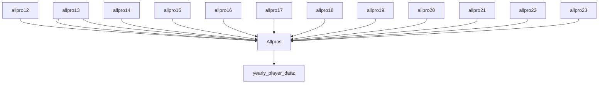

# AllProPredictor

**Problem Statement**

Can we build a model that correctly predicts whether or not a player made an All-Pro team in their respective season based on their stats?

**Background**

Getting selected to an All-Pro team is one of the highest individual accolades a player can receive during his career. Each yearly roster consists of just 22 players balanced across each position. Players, and especially Quarterbacks, are graded throughough their career based on how many of these teams they make, so finding the needle-moving stats for this honor is a very compelling problem for us to solve.

**Getting Started**

We start with 13 datasets, 1 that holds yearly player data dating back to 2012, and the other 12 holding the list of All-Pro teams from 2023-2012. Our job is to find a way to combine all of this information into one dataset that holds yearly stats from each player and a designation for if that player made an All-Pro team that year.

The above diagram depicts our source to target architecture flow that we need to achieve before we can begin modeling. First, we append each of the 12 All Pro lists to one another using Python's .concat() function, giving us the Allpros dataframe. Once that is acheived, we perform a left join on the two datasets by matching the player name and year in both and attaching 1 if the player made the All Pro team that year and a 0 if not: 

allpros = allpros.assign(All_Pro = 1)

merged = careerstats.merge(allpros, left_on=['player_name', 'season'], right_on=['Player', 'Year'], how='left')

After this and a few other data cleaning exercises, we are now ready for some analysis.

**Data Partitioning**

Before creating our logistic regression models, we need to partition our data into 3 separate dataframes, one for QB's, one for WR's, and one for RB's since each position have different relevant statistics for us to leverage.

rec = merged['position'].values == 'WR'
receivers = merged.loc[rec]

rb = merged['position'].values == 'RB'
rbacks = merged.loc[rb]

qb = merged['position'].values == 'QB'
quarterbacks = merged.loc[qb]

**Model Creation**

Now we are fully ready to create our models. We need to select the features we believe have a significant impact on All-Pro team selection for each position, create model training and test sets from our partitioned data, and run predictions on our test data using regression results from our training data. We do this here for each position:

WR's: 

rec_features = ['receptions', 'receiving_yards', 'yards_after_catch', 'reception_td', 'target_share', 'yptarget', 'draft_ovr', 'wins', 'receiving_air_yards']
rec_x = receivers[rec_features]
rec_y = receivers.All_Pro

rec_x_train, rec_x_test, rec_y_train, rec_y_test = train_test_split(rec_x, rec_y, test_size=0.25, random_state=16)

reclog = LogisticRegression(random_state=16)

reclog.fit(rec_x_train, rec_y_train)

rec_y_predict = reclog.predict(rec_x_test)

RB's:

run_features = ['touches', 'rushing_yards', 'total_tds', 'wins', 'yptouch']
run_x = rbacks[run_features]
run_y = rbacks.All_Pro

run_x_train, run_x_test, run_y_train, run_y_test = train_test_split(run_x, run_y, test_size=0.25, random_state=16)

runlog = LogisticRegression(random_state=16)

runlog.fit(run_x_train, run_y_train)

run_y_predict = runlog.predict(run_x_test)

QB's:

qb_features = ['pass_attempts', 'passing_yards', 'pass_td', 'interception', 'passer_rating', 'wins']
qb_x = quarterbacks[qb_features]
qb_y = quarterbacks.All_Pro

qb_x_train, qb_x_test, qb_y_train, qb_y_test = train_test_split(qb_x, qb_y, test_size=0.25, random_state=16)

qblog = LogisticRegression(random_state=16)

qblog.fit(qb_x_train, qb_y_train)

qb_y_predict = qblog.predict(qb_x_test)

**Preliminary Model Evaluation**

Now it's time to grade our models, and there are a few different ways we are going to do this:

Classification Report: report displaying 3 scores - Precision, Recall, F1
    - Precision tells us what percentage of our predictions were correct
    - Recall tells us what percentage of positive cases (All-Pro selections) were caught by the model
    - F1 Score tells us what percentage of positive predictions were correct

AUC Curve & Score: the curve tells us how sensitive our model is to each cutoff value, and the score given to us shows how well our model classifies All-Pro vs not All-Pro outcomes
    - Score ranges from 0.5 to 1, the greater the better

Feature Importance Table: tells us how well each selected feature is doing at predicting outcomes
    - Coefficients represent the change in the log odds for a one-unit change in the predictor variable, the futher from zero the better
    - Odds Ratios compare the odds of an event for two groups defined by a specific variable, so an odds ratio of greater than 1 signifies a significant mover of odds for a feature

Let's look at how our models graded using these statistics:

    
  
   
   
   

