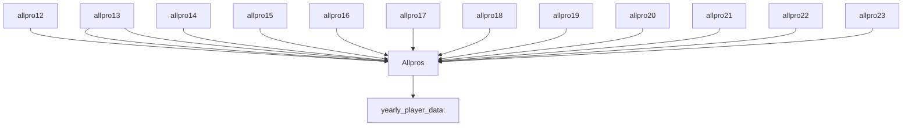

# AllProPredictor

**Problem Statement**
Can we build a model that correctly predicts whether or not a player made an All-Pro team in their respective season based on their stats?

**Background**
Getting selected to an All-Pro team is one of the highest individual accolades a player can receive during his career. Each yearly roster consists of just 22 players balanced across each position. Players, and especially Quarterbacks, are graded throughough their career based on how many of these teams they make, so finding the needle-moving stats for this honor is a very compelling problem for us to solve.

**Getting Started**
We start with 13 datasets, 1 that holds yearly player data dating back to 2012, and the other 12 holding the list of All-Pro teams from 2023-2012. Our job is to find a way to combine all of this information into one dataset that holds yearly stats from each player and a designation for if that player made an All-Pro team that year.



The above diagram depicts our source to target architecture flow that we need to achieve before we can begin modeling. First, we append each of the 12 All Pro lists to one another using Python's .concat() function, giving us the Allpros dataframe. Once that is acheived, we perform a left join on the two datasets by matching the player name and year in both and attaching 1 if the player made the All Pro team that year and a 0 if not: 

allpros = allpros.assign(All_Pro = 1)

merged = careerstats.merge(allpros, left_on=['player_name', 'season'], right_on=['Player', 'Year'], how='left')

After this and a few other data cleaning exercises, we are now ready for some analysis.

**Data Partitioning**

Before creating our logistic regression models, we need to partition our data into 3 separate dataframes, one for QB's, one for WR's, and one for RB's since each position have different relevant statistics for us to leverage.

rec = merged['position'].values == 'WR'
receivers = merged.loc[rec]

rb = merged['position'].values == 'RB'
rbacks = merged.loc[rb]

qb = merged['position'].values == 'QB'
quarterbacks = merged.loc[qb]rec = merged['position'].values == 'WR'
receivers = merged.loc[rec]

rb = merged['position'].values == 'RB'
rbacks = merged.loc[rb]

qb = merged['position'].values == 'QB'
quarterbacks = merged.loc[qb]

```mermaid
graph TD;
    yearly_player_data-->Quarterbacks:
    yearly_player_data-->Runningbacks:
    yearly_player_data-->Wide Receivers;
:
```


