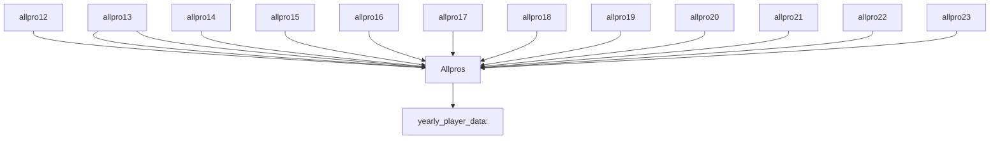

# AllProPredictor

**Problem Statement**
Can we build a model that correctly predicts whether or not a player made an All-Pro team in their respective season based on their stats?

**Background**
Getting selected to an All-Pro team is one of the highest individual accolades a player can receive during his career. Each yearly roster consists of 22 players balanced across each position. Players, and especially Quarterbacks, are graded throughough their career based on how many of these teams they make. Finding the needle-moving stats for this honor is a very compelling problem for us to solve since this list is so significant.

**Getting Started**
We start with 13 datasets, 1 that holds yearly player data dating back to 2012, and the other 12 holding the list of All-Pro teams from 2023-2012. Our job is to find a way to combine all of this information into one dataset that holds yearly stats from each player and a designation for if that player made an All-Pro team that year.

